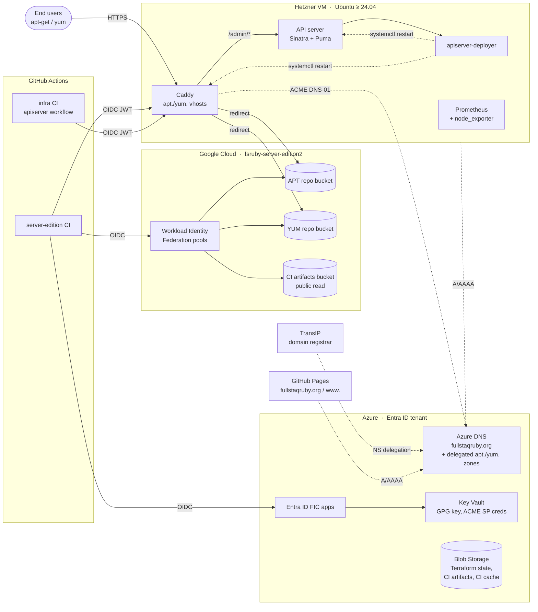

## Infrastructure overview

The following diagram shows the major infrastructure components and how they relate to each other. The role that administers each component is given in the section heading below.

## Google Cloud project

- Administered by role: Infra Owners (project resource); Infra Maintainers (resources within)

All Google Cloud resources live in a single project, `fsruby-server-edition2` (display name "Fullstaq Ruby Server Edition"). The `google_project` resource itself is provisioned in `terraform-hisec/gcloud_project.tf` so that creating/deleting the project requires Infra Owner access, but resources _inside_ the project (buckets, IAM, Workload Identity Federation) are managed in `terraform/` by Infra Maintainers.

The hisec / non-hisec separation is enforced at the **Terraform state and access-group layer**, not via separate GCP projects. See [Terraform state (normal)](#terraform-state-normal) and [Terraform state (hisec)](#terraform-state-hisec).

## CI/CD authentication

- Administered by role: Infra Maintainers

CI/CD authenticates using short-lived GitHub-issued OIDC tokens — there are no long-lived service-account keys.

- **`fullstaq-ruby/server-edition` → Google Cloud** uses [Workload Identity Federation](https://cloud.google.com/iam/docs/workload-identity-federation) (defined in `terraform/gcloud_auth.tf`). Two pools (`github-ci-test`, `github-ci-deploy`) gate access by GitHub repository owner and Actions environment. Through these pools, server-edition CI jobs gain write access to the APT/YUM repo buckets and the GCP CI artifacts bucket — see `terraform/repo_buckets.tf` and `terraform/ci_storage.tf`. The CI cache lives in Azure (see below), not on GCP.
- **`fullstaq-ruby/server-edition` → Azure** uses [Federated Identity Credentials](https://learn.microsoft.com/en-us/entra/workload-id/workload-identity-federation) on Entra ID applications (defined in `terraform-hisec/`). These authenticate workflows that read or write Azure Blob Storage (the CI artifacts and CI cache containers) and Azure Key Vault (the GPG signing key).
- **`fullstaq-ruby/infra` → API server** uses a GitHub-issued OIDC JWT (audience `backend.fullstaqruby.org`) sent as a bearer token to `POST /admin/upgrade_apiserver`. The infra repo's `apiserver.yml` workflow does **not** authenticate to GCP or Azure APIs — the rollout mechanism is entirely on the VM (see [API server](#api-server)). The same JWT mechanism is used by `server-edition` to call `/admin/restart_web_server` after a publish.

## API server

- Administered by role: Infra Maintainers

The API server is a small Sinatra service that exposes a narrow set of `/admin/*` endpoints used by CI/CD: notably `restart_web_server` (called by Server Edition's CI after a publish so Caddy picks up the new repo version) and `upgrade_apiserver` (called by this repo's CI to roll out a new API server build). All endpoints authenticate the caller via GitHub Actions OIDC JWTs.

The API server runs on the backend VM (see [VM (Hetzner)](#vm-hetzner)) under systemd, with Puma listening on a Unix socket that Caddy proxies to. It is provisioned by Ansible (`ansible/tasks/apiserver.yml`, unit file `ansible/files/apiserver.service`).

Releases are built and published by `.github/workflows/apiserver.yml`: the workflow packages the source as a tarball, attaches it to a GitHub Release tagged `apiserver-N`, and then calls `POST /admin/upgrade_apiserver`. That request is handled by a sibling `apiserver-deployer.service` (provisioned alongside) which fetches the release tarball into `/opt/apiserver/versions/` and restarts the API server. The deployer exists so the API server can replace itself without leaving an unreachable gap.

## Caddy web server

- Administered by role: Infra Maintainers

Caddy runs on the backend VM (see [VM (Hetzner)](#vm-hetzner)) and serves two virtual hosts: `apt.fullstaqruby.org` and `yum.fullstaqruby.org` (see `ansible/files/Caddyfile`). Each vhost has the same shape:

- `/admin/*` is reverse-proxied over a local Unix socket to the API server.
- All other paths redirect to the corresponding GCS repo bucket, with the current published version baked into the redirect target.

There is no separate `backend.fullstaqruby.org` virtual host — the hostname exists as a DNS record (and as the OIDC token audience claim) but is not terminated by Caddy. CI/CD calls the `/admin/*` endpoints via `https://apt.fullstaqruby.org/admin/*`.

The redirect target's version is read from each bucket's `latest_version.txt` once at startup (via the `query-latest-repo-versions.rb` `ExecStartPre` in the systemd unit). Caddy must therefore be restarted after a publish so it picks up the new version — that restart is what the API server's `restart_web_server` endpoint exists to trigger.

Users interact with `{apt,yum}.fullstaqruby.org` rather than the buckets directly. This decouples users from where the repos are actually hosted, allowing us to change the hosting mechanism without breaking users' repository URLs.

> Historic note: our APT and YUM repos used to be hosted on Bintray. But Bintray shut down on March 1 2021. The HTTP redirection mechanism allowed us to move away from Bintray with minimal downtime, and without breaking users' repository URLs.

TLS certificates are obtained via the ACME DNS-01 challenge against Azure DNS. Caddy authenticates to Azure DNS using a service principal whose credentials are stored in Azure Key Vault and injected into the Caddy systemd unit via an environment file.

## VM (Hetzner)

- Administered by role: Infra Maintainers

A single Ubuntu (≥ 24.04) VPS hosted at Hetzner runs every backend service (Caddy, the API server, the API server deployer, Prometheus + node_exporter, fail2ban, AppArmor, unattended-upgrades, ufw). Its forward DNS records (`backend.fullstaqruby.org`, `apt.fullstaqruby.org`, `yum.fullstaqruby.org`) are managed in `terraform/dns.tf`; its static IPs are referenced from `terraform/variables.tf`. The PTR record (`backend.fullstaqruby.org`) is set manually at the Hetzner provider during bootstrapping (see [bootstrapping](infrastructure-bootstrapping.md) Step 7), not via Terraform.

The VM is configured entirely by Ansible (`ansible/main.yml`). The playbook covers OS hardening (SSH, fail2ban, AppArmor, ufw, autoreboot, unattended-upgrades) and the service stack (Prometheus, Caddy, apiserver-deployer, apiserver). There is no Kubernetes — the previous GKE Autopilot setup was replaced by this VM in the July 2024 rearchitecture.

## DNS

- Administered by role: Infra Maintainers

All DNS records for `fullstaqruby.org` are managed in Azure DNS (`terraform/dns.tf`).

- `fullstaqruby.org` and `www.fullstaqruby.org` point to GitHub Pages, where we host the [website](https://github.com/fullstaq-ruby/website).
- `backend.fullstaqruby.org`, `apt.fullstaqruby.org`, and `yum.fullstaqruby.org` all resolve to the backend VM's IP addresses.

`apt.fullstaqruby.org` and `yum.fullstaqruby.org` are also delegated as their own Azure DNS zones so that Caddy's ACME service principal has DNS-write access scoped only to those subdomains, not the parent zone.

## Domain name

- Administrated by role: Infra Owners

The `fullstaqruby.org` domain is registered at [TransIP](https://www.transip.nl/). It's registered using [Fullstaq](https://www.fullstaq.com)'s account. The DNS zone is not managed at TransIP, but at Azure DNS (see [DNS](#dns)).

## Github CI bot account

- Administered by role: Infra Owners

This Github bot account is used by the Server Edition's CI/CD system. The account itself (and its email address) is administered by Infra Owners. It has a personal access token, which is installed as a secret in the Server Edition's repo, so that its CI/CD system can perform work under the bot account.

## Terraform state (normal)

- Administered by role: Infra Maintainers

The Terraform state for normal infrastructure is stored in an Azure Blob Storage container in the `fullstaq-ruby-terraform` resource group (see `terraform/backend.tf`).

## Terraform state (hisec)

- Administered by role: Infra Owners

The Terraform state for sensitive infrastructure is stored in an Azure Blob Storage container in the `fullstaq-ruby-terraform-hisec` resource group (see `terraform-hisec/backend.tf`).

## Server Edition APT & YUM repo buckets

- Administered by role: Infra Maintainers

The Server Edition's APT and YUM repositories are stored inside these buckets. These buckets are publicly readable.

Users don't access these buckets directly. Instead, they access `apt.fullstaqruby.org` and `yum.fullstaqruby.org` (served by Caddy on the backend VM), which redirect to these buckets.

## Server Edition CI artifacts store

- Administered by role: Infra Maintainers

The Server Edition's CI/CD system stores artifacts for [CI/CD resumption](https://github.com/fullstaq-ruby/server-edition/blob/main/dev-handbook/ci-cd-resumption.md) in two buckets (see `terraform/ci_storage.tf`):

- A **GCS bucket** (`${var.gcloud_bucket_prefix}-server-edition-ci-artifacts`) — publicly readable; the `test` environment writes via WIF, the `deploy` environment reads. Objects expire after 30 days.
- An **Azure Blob container** (`server-edition-ci-artifacts` inside the `${var.storage_account_prefix}seredci1` storage account) — private; the `test` environment writes via Federated Identity Credentials, the `deploy` environment reads. Objects expire after 30 days.

## Server Edition CI cache store

- Administered by role: Infra Maintainers

The Server Edition's CI/CD system stores caches in an **Azure Blob container** (`server-edition-ci-cache` inside the same `${var.storage_account_prefix}seredci1` storage account; see `terraform/ci_storage.tf`). Only the `test` environment writes; objects are automatically deleted 90 days after last access. There is no equivalent cache bucket on GCP.

## GPG private key

- Administered by role: Infra Owners, Infra Maintainers

The GPG private key is used to sign APT and YUM repositories. It is stored in the Azure Key Vault for Infra Owners — `${var.key_vault_prefix}infraowners`, currently `fsruby2infraowners` (see `terraform-hisec/key_vault.tf`). GitHub Actions in the `test` and `deploy` environments are granted read access via Entra ID Federated Identity Credentials.
